<p align="center">
  
</p>

# From Benchmarking to Application: PanGeneWhale, a User-Friendly Platform for Pangenomic Analysis
<p align="justify">The choice of software for pan-genomic analysis is challenging due to barriers such as usability, performance, complexity, and the diversity of available solutions. These issues often require advanced knowledge and compromise reproducibility. To explore this scenario, we conducted a comprehensive benchmarking of 12 tools applied to 50 <em>Escherichia coli</em> genomes. The analysis revealed significant disparities in computational performance (CPU, memory, and storage usage) and in the biological composition of the generated pangenomes. Critical usability barriers were also identified, including outdated dependencies and a lack of graphical interfaces. To overcome these limitations, the benchmarking motivated the development of PanGeneWhale, a platform that integrates the evaluated solutions in a containerized environment (Docker). With an intuitive, cross-platform graphical interface, the software automates execution flows, ensures reproducibility, and broadens access to pan-genomic analysis. Thus, it represents a solution that supports both researchers with limited computing experience and advanced users, simplifying the conduct of large-scale studies.</p>

### Technology
<image src="https://github.com/allanverasce/allanverasce/assets/25986290/e9eef5db-3d9e-419d-bc31-c29c16076146" alt="Image" width="50"/>
<image src="https://github.com/user-attachments/assets/3406d50a-a37b-4980-976f-61d0cf916957" alt="Image" width="50" />
<image src="https://github.com/user-attachments/assets/b1cb9cb4-33f1-4069-8c0b-078dbf994847" alt="Image" width="50" />
<image src="https://github.com/user-attachments/assets/5b44250e-ced9-46a6-84dd-a4954f408495" alt="Image" width="50" />

### Compatible with:
<image src="https://github.com/allanverasce/allanverasce/assets/25986290/3f178481-786d-4e6f-b46f-7e10732e9ca8" alt="Image" width="50"/>
<image src="https://github.com/user-attachments/assets/3ba215a2-9849-4e21-a84c-e7e32bdc19aa" alt="Image" width="50" />
<image src="https://github.com/user-attachments/assets/97a4af37-07f2-4283-ae7d-9a1db3e51d50" alt="Image" width="50"/>


# Installation and User Guide 

Before using PanGeneWhale, it is necessary to ensure that all required dependencies are properly installed. This section provides an overview of the software and libraries that must be set up in advance, allowing the tool to run smoothly and without compatibility issues.

### Dependencies
- To use PanGeneWhale, it is required to have Docker installed on your operating system. Docker provides the containerized environment necessary to run PanGeneWhale. You can find the official instructions and download them at: `https://docs.docker.com/engine/install`
- You need to install Java if you want to run it using the JAR package. To use this option, the user must have Java 17 previously installed on their system. The official Java 17 package can be downloaded from: `https://www.oracle.com/java/technologies/javase/jdk17-archive-downloads.html`
  

# 1. PanGeneWhale installation 
To install the software, locate the package folder and choose the installer compatible with your operating system.

[Download packages](https://github.com/allanverasce/pangenewhale/tree/main/packages)


# 2. Examples of how to install PanGeneWhale

- **LINUX (Debian 12 e 13):** To install using the standard .deb package, follow the model below. Run the line on your Linux terminal 

```bash
apt install ./pangenewhale-installer-deb-12-x64-1.0.0.deb
```

- **macOS:**  Run the line on your terminal
```bash
java -jar PanGeneWhale-macos-x64-1.0.0.jar
```

- **Using the JAR package.** Open the terminal and run using JAVA, following the example below:

```bash
java -jar PanGeneWhale-linux-x64-1.0.0.jar
```

# 3. Main window PanGeneWhale
When you start the application, you will see the presentation screen. Here, the user will find a brief description of the software. To access more information, simply click on the "Learn More" button. On this same screen, all previously created projects are listed. The user can:

* View details of previous projects.
* Reuse existing projects for reprocessing with already configured parameters;
* Delete projects that are no longer needed.
* You can also start a new workflow by clicking on “Create New Project”

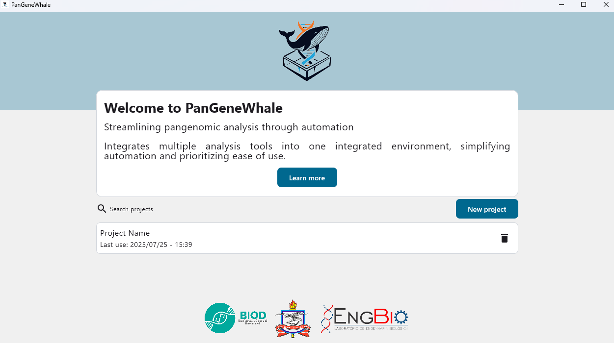 

# 4. Create a new project window
To start a new project, click on the **"New Project"** button. A window will then appear, as shown in the figure below, asking you to enter a name for the project, then press the **“Create”** button. We recommend using a name that is descriptive and related to your analysis, to facilitate future searches and reuse.

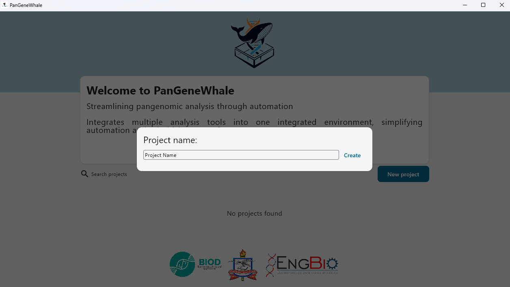 

# 5. Tool Selection and Parameter Configuration window
In the next window, the user can customize their analysis. The available options are:
* Select the desired tool to perform the analysis;
* Use standard parameters provided by each tool, previously added to the PanGeneWhale database;

## Adjusting settings
  -  Change existing values;
  -  Add new parameters;
  -  Define which parameters will be used or removed from the analysis.
  -  Data input - where the user will inform the location of the data that will be processed in their analysis. As well as where the processing results will be made available. In addition, the input file must be checked individually in the manual for the respective tool. 

**Note:** Both the input files and the parameterization can (and should) be adjusted according to the selected tool and the objectives of your analysis. For detailed information about each tool, supported inputs, and parameters, refer to the specific manual for the selected tool.

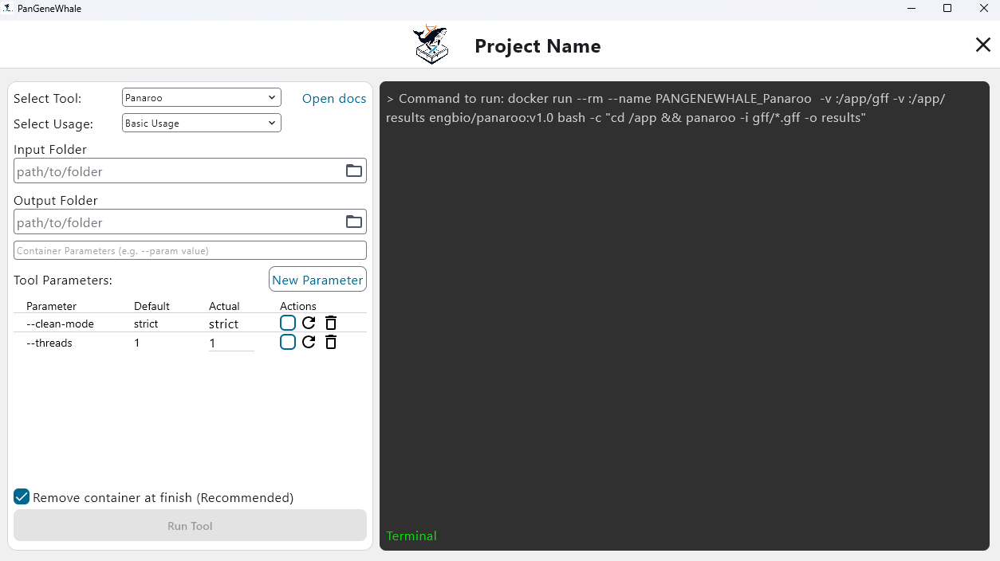 

# Viewing available commands and settings in the simulated terminal area
In the previous window, you can view the command that will be executed in the PanGeneWhale terminal area.

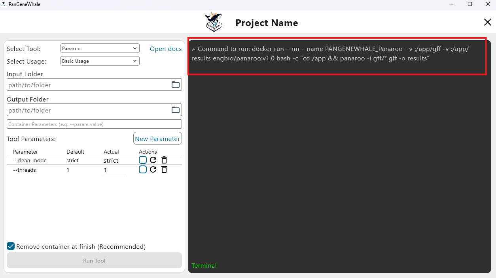 

In the **“Tool Parameters”** section, the parameters previously registered in the database are displayed. The user can:
- Select one or more existing parameters;
- The selected parameters are automatically inserted into the command line, without the need for manual typing.
- See the example below: When you select a parameter from the list, it is immediately included in the command displayed in the terminal, facilitating the configuration of the analysis.
  
**Note:** You can see in the example that the location information for the data to be processed has been entered, which activates the “Run Tool” button. Therefore, we recommend entering the data after adjusting the parameters. However, the order does not impact the analysis.

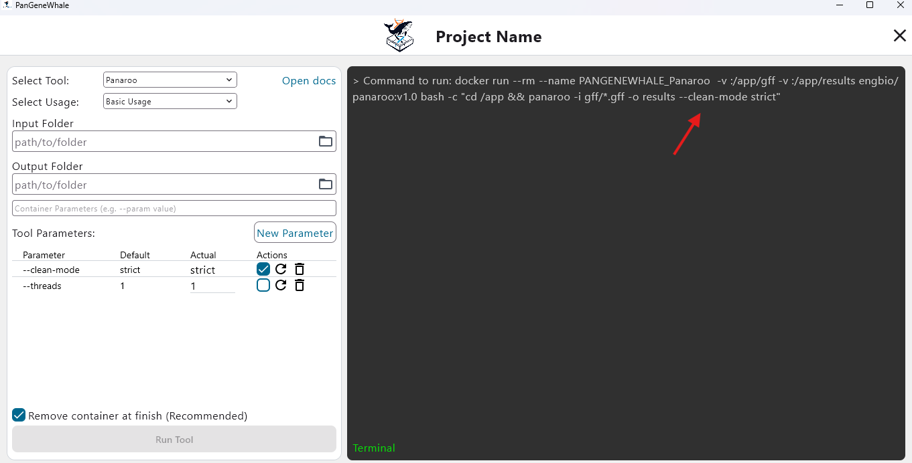 

# Adding a New Parameter
To add a new parameter, click the “New Parameter” button. An editing area will appear, allowing you to manually enter the desired parameter.

**Note:** Check whether the parameter requires an associated value. For example: `-threads 1`. In this case, -threads represents the number of threads (processing cores) option, and 1 is the assigned value.
To ensure the correct use of parameters, refer to the manual for the selected tool, where you will find a detailed description of each parameter.
Finally, the user must press the **“Save”** button to add it to the database.

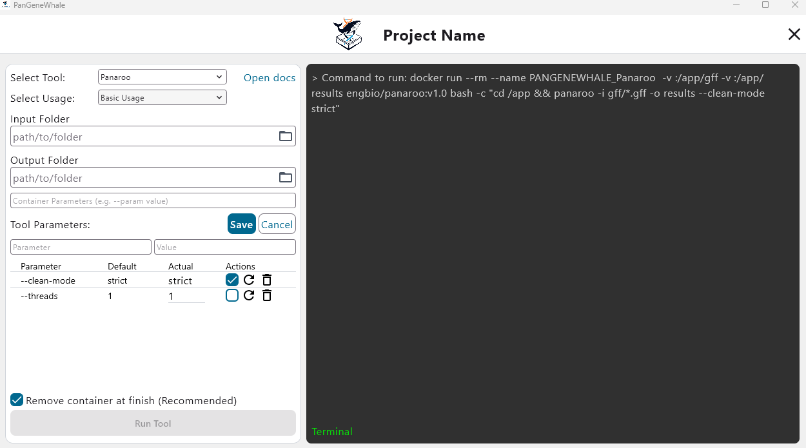 

After finalizing the parameter adjustments and entering the input data to start the execution, the user simply presses the **“Run Tool”** button. The next figure shows an example of the analysis execution. It is possible to follow all the processing performed by the selected tool in the Terminal area.

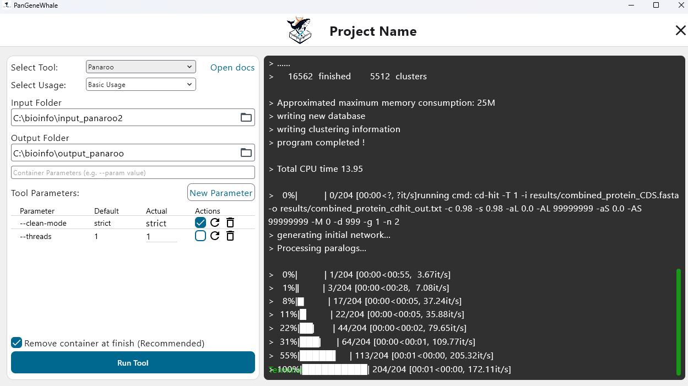 


# Running a project, usage scenario.
After creating your project on the home screen, the user will be directed to this window. Below, we will describe a usage scenario using the Panaroo tool with the input file in the .gff standard.

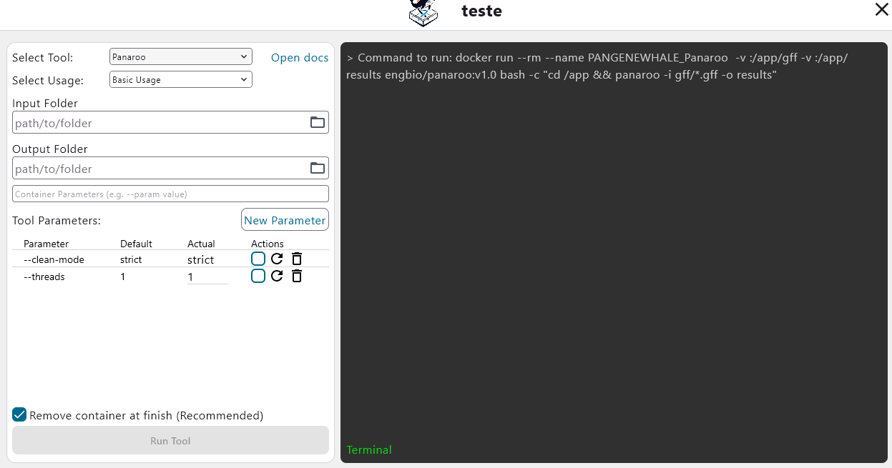 

## Select Tool:
Select the tool you want for the analysis. In this case, the tool chosen was Panaroo.

 

## Input Folder: 
Specify the folder containing the files you want to analyze. Make sure these files are compatible with the selected tool. In this example, we use .gff files.

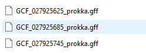 

The files located in input_panaroo are used as sample data to illustrate the functionality of the tool.

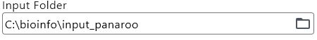 

## Output Folder:
Define the desired location for storing the output files generated by the tool once the analysis is complete. It is recommended that the name of the chosen folder be clear, to facilitate the location and identification of the files.

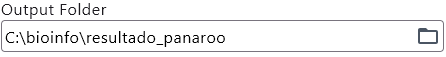 

## New Parameter:
In this section, you will find parameters designated for specific analyses. To use them, select the parameter. For basic use of the tool, it is not necessary to fill in these fields, as the default parameters are included in the command line. It is important to consult the documentation for the correct insertion of values, if necessary. It is important to note that some parameters have associated values, as in the example below: --clean-mode has a value of strict, however, you may encounter tools that only use the parameter without a value.

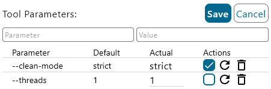 

**Note:** After all the adjustments are made, just click the **RUN** button

## Results example:

In this example, the expected results of the analysis are as follows; however, they may vary depending on the tool used.

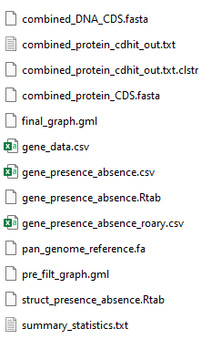 


